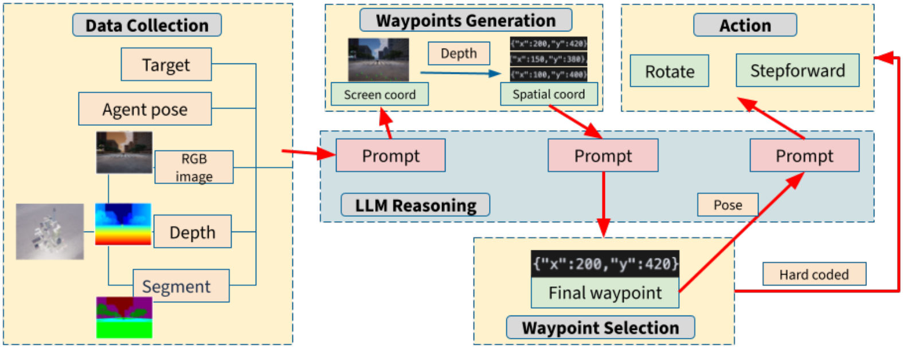
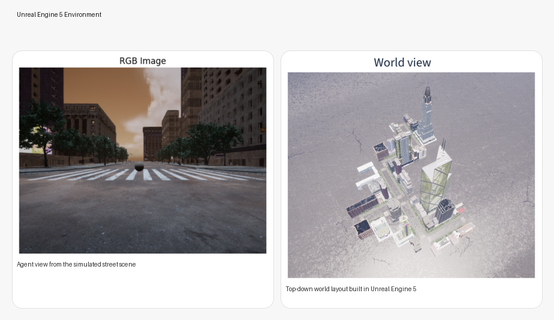
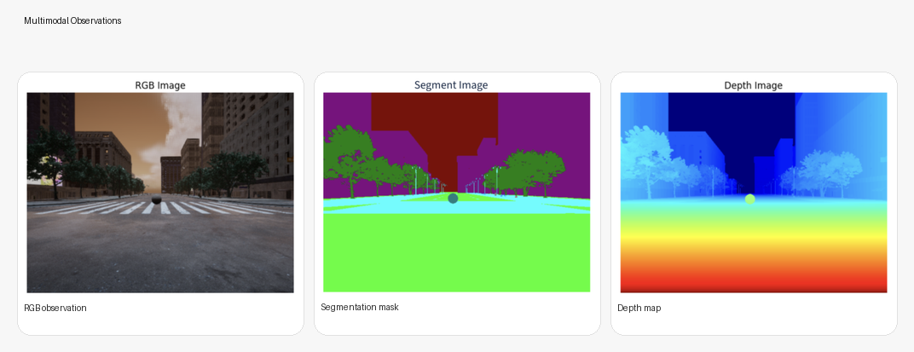
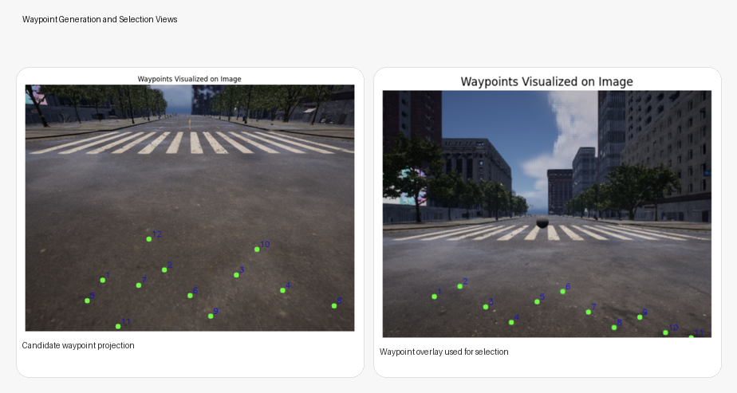
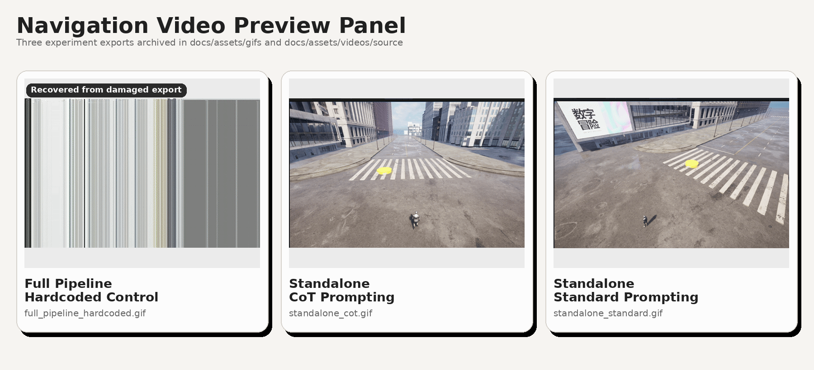
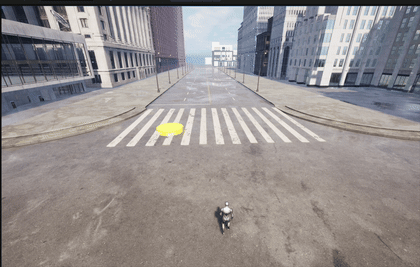
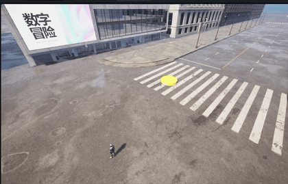

# ZENITH

  

  <strong>Zero-shot waypoint navigation in city-scale Unreal Engine 5 environments using multimodal scene observations and language-model reasoning.</strong>

  SimWorld + Unreal Engine 5 + RGB/Depth/Segmentation + LLM waypoint planning

ZENITH is a waypoint-driven navigation system for simulated urban environments. At each step, the agent observes the scene through an RGB camera, a depth map, and a segmentation mask, proposes candidate waypoints in image space, projects them into world coordinates, selects the best next waypoint, and executes a short-horizon movement command.

The project explores whether a language model can act as a zero-shot spatial planner without relying on a precomputed global map or task-specific training. The implementation in this repository includes the navigation loop, simulator communication layer, waypoint prompts, perception fallbacks, project report, and source media from the experiments.

## Highlights

- Zero-shot waypoint generation from RGB, depth, and segmentation inputs
- Pixel-to-world projection for turning image-plane waypoints into executable 3D targets
- Closed-loop navigation inside a SimWorld / Unreal Engine 5 environment
- Reported evaluation on waypoint-selection success and end-to-end goal-reaching success
- Standalone comparisons between hardcoded control, standard prompting, and Chain-of-Thought prompting

## System Pipeline

The navigation loop follows four main stages:

1. Capture the current RGB view, depth map, segmentation mask, and agent pose.
2. Prompt the model to generate navigable waypoint candidates in image coordinates.
3. Convert those waypoint pixels into world coordinates and select the best candidate.
4. Execute a short movement toward the chosen waypoint, then repeat.

In the current repository snapshot, the core logic is split across:

- `agent/nav_agent.py` for the main navigation loop
- `nav_llm/nav_llm.py` for waypoint generation and selection prompts
- `utils/pixel_utils.py` for waypoint visualization and pixel-to-world conversion
- `agent/nav_move.py` for low-level rotate-and-step movement
- `communicator/` for simulator and UnrealCV integration

## Unreal Engine 5 Environment

ZENITH runs inside a city-scale environment built through SimWorld on top of Unreal Engine 5. The environment provides both the street-level first-person view used for navigation and a global top-down view used for debugging and evaluation.

The left view is the agent-facing street scene used for decision making. The right view shows the broader urban layout that was generated for the navigation experiments.

## Multimodal Observations

Each planning iteration uses three aligned visual inputs:

- RGB image for semantic scene understanding
- Segmentation mask for separating traversable regions from obstacles
- Depth map for estimating spatial structure and projecting points into the world frame

This combination is what makes the waypoint formulation practical: the language model reasons over the visual context, while depth and camera intrinsics make the selected waypoint executable in world coordinates.

## Waypoint Generation and Selection

ZENITH uses a short-horizon planning strategy. Instead of asking the model to output a full route, the model proposes a set of local waypoint candidates that are visible in the current frame. Those candidates are then projected into world coordinates, compared against the current goal, and used to drive the next action.

The intended waypoint behavior is:

- place candidates on traversable ground
- avoid obvious obstacles and non-ground surfaces
- keep candidates spatially spread out rather than tightly clustered
- favor options that preserve forward progress toward the destination

This design keeps the reasoning problem local, but it also creates a known limitation: when the goal is outside the field of view, the system can choose locally sensible steps that are globally suboptimal.

## Demo Media

The repository now includes archived experiment videos together with lightweight GIF previews stored under `docs/assets`.

The hardcoded-control export arrived without valid QuickTime metadata, so its preview was recovered from a repaired copy and is visually degraded compared with the two standalone runs.

### GIF Previews

- [Full pipeline hardcoded control GIF](docs/assets/gifs/full_pipeline_hardcoded.gif)
- [Standalone navigation with CoT prompting GIF](docs/assets/gifs/standalone_cot.gif)
- [Standalone navigation with standard prompting GIF](docs/assets/gifs/standalone_standard.gif)

### Embedded Standalone GIFs

The two standalone runs are embedded below so they can be previewed directly in the README.

#### Chain-of-Thought Prompting

#### Standard Prompting

### Source Recordings

- [Full pipeline (hardcoded control) repaired MP4](docs/assets/videos/source/Full%20pipeline%20%28hardcoded%20control%29_fixed.mp4)
- [Full pipeline (hardcoded control) original MOV](docs/assets/videos/source/Full%20pipeline%20%28hardcoded%20control%29.mov)
- [Standalone navigation with CoT prompting](docs/assets/videos/source/Standalone%20navigation%20with%20CoT%20prompting.mov)
- [Standalone navigation with standard prompting](docs/assets/videos/source/Standalone%20navigation%20with%20standard%20prompting.mov)

## Results

The report evaluates ZENITH across 8 navigation episodes and measures both intermediate waypoint quality and final task success.

### Main Navigation Results

| Model | Waypoint Selection Success Rate | Goal Success Rate |
| --- | ---: | ---: |
| GPT-4o mini | 71.04% | 12.50% |

### Local Execution Comparison

| Strategy | Summary |
| --- | --- |
| Hardcoded controller | Most reliable and most direct local movement behavior |
| Standard prompting | Can succeed on simple motions, but often struggles with angle estimation and rotation-heavy cases |
| Chain-of-Thought prompting | Better than standard prompting, but still less direct and less stable than the hardcoded controller |

### Interpretation

- The system is reasonably good at selecting locally plausible next waypoints.
- End-to-end goal completion remains difficult because local waypoint quality does not automatically produce strong long-horizon navigation.
- The largest failure mode is drift: once the agent turns away from the destination, its future waypoint proposals can keep moving it farther from the goal.
- The low-level hardcoded controller is currently stronger than language-model-based local control.

## Repository Layout

| Path | Purpose |
| --- | --- |
| `agent/` | Navigation loop and movement controllers |
| `communicator/` | UnrealCV and simulator communication utilities |
| `manager/` | Task orchestration and multi-threaded execution |
| `nav_llm/` | Language-model interface and structured waypoint prompting |
| `utils/` | Pixel conversion, vector math, depth fallback, segmentation fallback, prompt templates |
| `navReq_utils/` | Task, asset, and environment JSON configuration files |
| `docs/assets/paper/` | Cropped images extracted from the project report |
| `docs/assets/panels/` | README-ready composite panels built from the paper figures |
| `docs/assets/gifs/` | GIF previews generated from the three experiment recordings |
| `docs/assets/videos/source/` | Archived source video recordings |

## Key Limitations

- The policy is strongly local and can struggle when the destination is outside the current field of view.
- Goal success is much lower than waypoint-selection success, which indicates compounding errors over time.
- The current implementation relies on short-horizon geometric execution rather than a full global planner.
- Fallback segmentation and depth generation are helpful for prototyping, but they are not equivalent to simulator-ground-truth perception.

## Included Reference Material

- [Project report PDF](Project_final_report.pdf)
- [Extracted report figures](docs/assets/paper)
- [Generated README panels](docs/assets/panels)
- [GIF previews](docs/assets/gifs)
- [Archived experiment media](docs/assets/videos/source)

## Summary

ZENITH is best understood as a practical exploration of language-model-guided waypoint navigation rather than a finished navigation stack. Its main contribution is the end-to-end integration of multimodal scene capture, waypoint reasoning, pixel-to-world projection, and short-horizon execution inside a high-fidelity Unreal Engine 5 environment.
